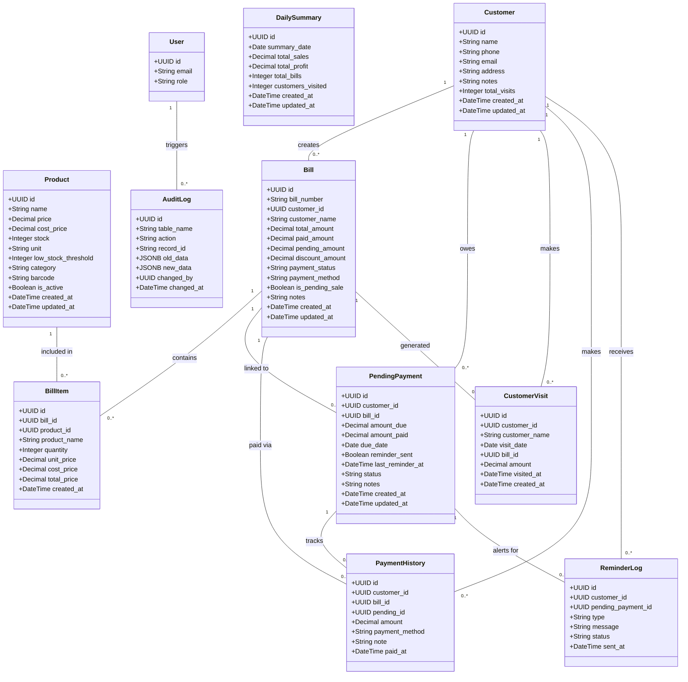

# POS Software Class Diagram

This diagram represents the database entities (tables) and their relationships based on the provided SQL setup script. It serves as a class diagram (Entity-Relationship diagram) for the backend of the POS system.

